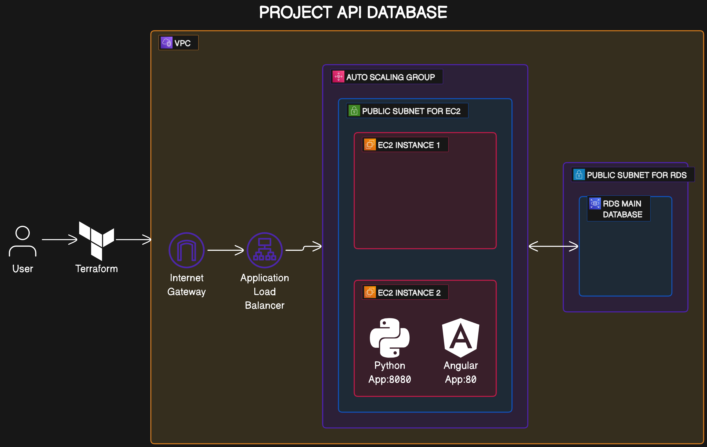

Terraform Project

Terraform Project
=================

This is a Terraform project that sets up a VPC with subnets, an internet gateway, a route table, and a NAT gateway on AWS. It also generates an RSA private key for SSH access and creates an AWS key pair using the generated RSA public key.

## Original request architecture.

## Architecture answer to this challengue.

Prerequisites
-------------

*   Terraform v1.0.0 or later
*   AWS Provider v5.36.0 or later
*   Null Provider v3.2.2 or later

Usage
-----

1.  Clone the repository to your local machine.
2.  Navigate to the directory containing the Terraform files.
3.  Initialize the Terraform workspace, which will download the provider plugins:

    `terraform init`

5.  Validate the Terraform configuration files:

    `terraform validate`

7.  Plan the deployment. This step confirms what changes will be made:

    `terraform plan`

9.  Apply the changes:

    `terraform apply`

11.  If everything is set up correctly, Terraform will apply the changes and output the public IP address of the instances.

Resources Created
-----------------

This Terraform configuration will create the following resources:

*   A VPC with the specified CIDR block and DNS hostnames enabled.
*   An internet gateway attached to the VPC.
*   A route table for the VPC that points all traffic (0.0.0.0/0) to the internet gateway.
*   Two subnets in different availability zones within the VPC.
*   An Elastic IP address for the VPC.
*   A NAT gateway in the specified subnet, associated with the Elastic IP address.
*   A network interface in the specified subnet, assigned a private IP address.

Note
----

This configuration is intended for development purposes. It's your responsibility to harden it for production use.

#Video with the answer to project 4:
## https://www.youtube.com/watch?v=03fnj4TSAwI

Health Check Script
-------------------

A health check script is included to check the status of the server. The script sends a request to the server and waits for a 200 OK response.

To run the health check script:

    bash health_check.sh 

Replace with the URL of your server.

Please let me know if you need any further assistance or modifications. 😊
