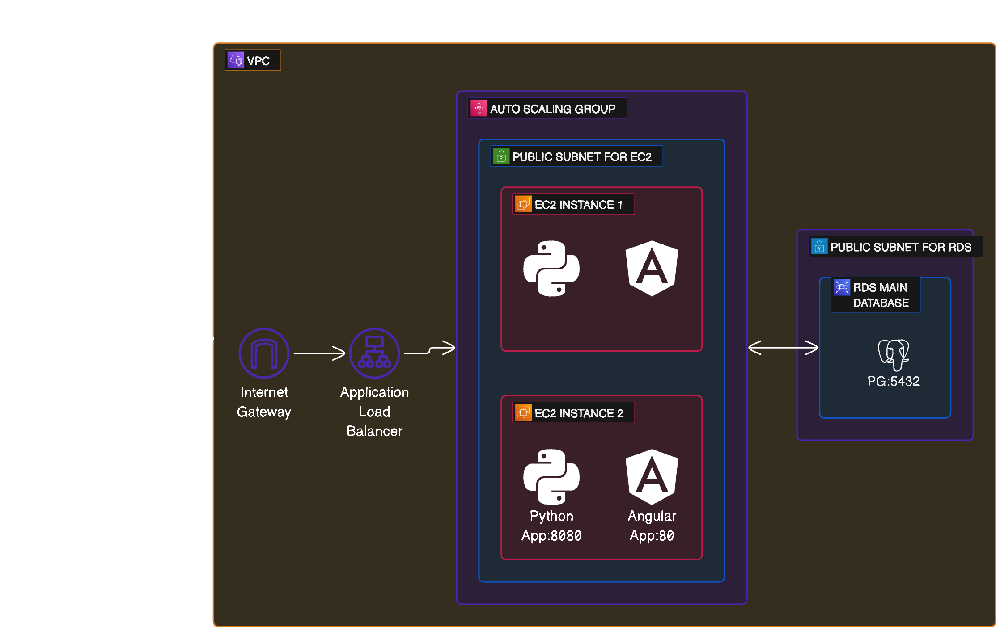

Terraform Project

Terraform Project
=================

This is a Terraform project that sets up a VPC with subnets, an internet gateway, a route table, and a NAT gateway on AWS. It also generates an RSA private key for SSH access and creates an AWS key pair using the generated RSA public key.

## Original request architecture.

###
In this project, students will work in a team to deploy an API microservice connected to a database. This API will have exposed endpoints that users can send HTTP requests to and get a response. Data will be returned to users as JSON payloads. AWS cloud infrastructure will be provisioned using any of AWS CLI, bash shell scripts, boto3, or Terraform and/or Ansible. Specifically, the AWS cloud environment will have a VPC, internet gateway, public subnet, public route table, EC2 instances. These scripts will be stored in GitHub. Optionally, students can deploy the API’s and databases as containers into a container environment.

Requirements
============

Create a database to store some simple data using any data of your choice and using any database server of your choice. For example, you can use the attached NHL data that has data on NHL hockey players, their goals, assists, and points. Some examples of databases you can use to store the data include MySQL, PostgreSQL, MongoDB, etc.

Create an API server in any programming language and framework of your choice. Some examples:

*   FastAPI
*   Node + Express
*   Java Springboot

Create a few GET endpoints in your API server so users can retrieve data from your database via your API microservice. Some examples of endpoints:

*   `/players`: Returns the first 10 players from the data, e.g., via query SELECT Player Name FROM nhl LIMIT 10
*   `/toronto`: Returns all players from the Toronto Maple Leafs, e.g., via query SELECT Player Name FROM nhl WHERE Team = ‘TOR’
*   `/points`: Returns top 10 players leading in points scored, e.g., via query SELECT Player Name,Pts FROM nhl ORDER BY Pts LIMIT 10

Deploy your database server and API microservice on the AWS cloud. Ensure your API is accessible on the public internet.

Documentation
=============

Create a public GitHub repo to store all your code used in this project. Create a README.md in your GitHub repo. In the README.md:

*   URL to public GitHub repo.
*   Architectural diagrams depicting the AWS cloud infrastructure setup, the API and database architectures, and any other pertinent visualizations.
*   Include instructions on how users can use your API service, including available endpoints.

Bonus
=====

If you want to make your API microservice fancy, you can create a frontend e.g., Angular, React, Bootstrap, etc., to allow users to interact with your API endpoints. However, this is not necessary. Users can hit your endpoints via entering the endpoints as URL’s in the web browser, using Postman, or other API clients, etc.

To add high availability and scalability to your API service, you can deploy your API in EC2 instances that are part of an autoscaling group, and add an application load balancer in front. Your users will then hit your API via the application load balancer address.

You can also deploy these API and database microservices as containers in a container environment.

Note: Sample data file you can use for your database can be found in the tab "Exercise Files". The file is called "nhl-stats-2022.csv".

Submission Instructions
=======================

In the README.md of your GitHub repo include the names of members in your group. Download a Zip file of your completed GitHub repo. Click on Hand In tab in the learning portal project page. Click on Upload Assignment and upload the zip file.

After you have submitted your assignment, make your API service available on the public internet - e.g., turn on your AWS and/or container environment that are hosting the API and database - and notify Nhat with the address to your API and API endpoints. Nhat will then test some the endpoints.

## Architecture answer to this challengue.

Prerequisites
-------------

*   Terraform v1.0.0 or later
*   AWS Provider v5.36.0 or later
*   Null Provider v3.2.2 or later

Usage
-----

1.  Clone the repository to your local machine.
2.  Navigate to the directory containing the Terraform files.
3.  Initialize the Terraform workspace, which will download the provider plugins:

    `terraform init`

5.  Validate the Terraform configuration files:

    `terraform validate`

7.  Plan the deployment. This step confirms what changes will be made:

    `terraform plan`

9.  Apply the changes:

    `terraform apply`

11.  If everything is set up correctly, Terraform will apply the changes and output the public IP address of the instances.

Resources Created
-----------------

This Terraform configuration will create the following resources:

*   A VPC with the specified CIDR block and DNS hostnames enabled.
*   An internet gateway attached to the VPC.
*   A route table for the VPC that points all traffic (0.0.0.0/0) to the internet gateway.
*   Two subnets in different availability zones within the VPC.
*   An Elastic IP address for the VPC.
*   A NAT gateway in the specified subnet, associated with the Elastic IP address.
*   A network interface in the specified subnet, assigned a private IP address.

Note
----

This configuration is intended for development purposes. It's your responsibility to harden it for production use.

#Video with the answer to project 5:
## Video answer part 1
    https://www.youtube.com/watch?v=8iO5Td11LSU
## Video answer part 2
    https://www.youtube.com/watch?v=hACXaeXimWc

Health Check Script
-------------------

A health check script is included to check the status of the server. The script sends a request to the server and waits for a 200 OK response.

To run the health check script:

    bash health_check.sh 

Replace with the URL of your server.

Please let me know if you need any further assistance or modifications. 😊
